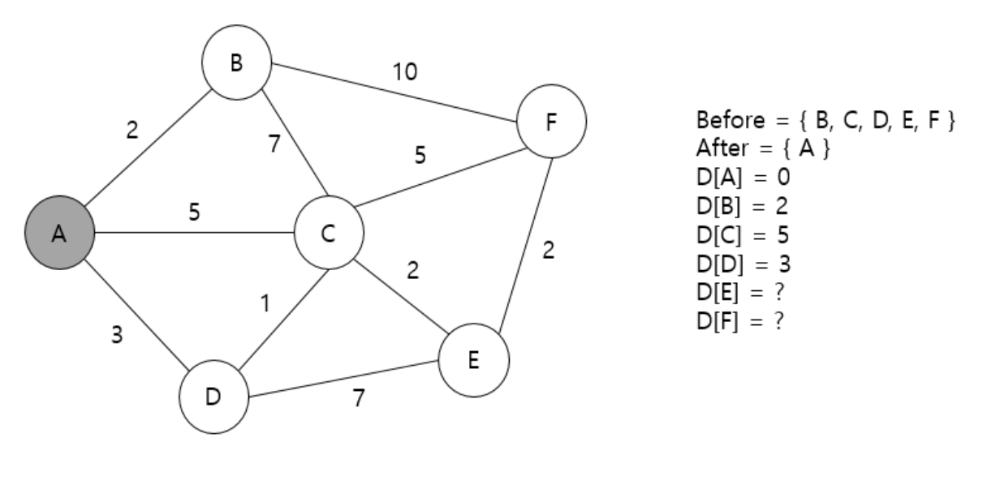
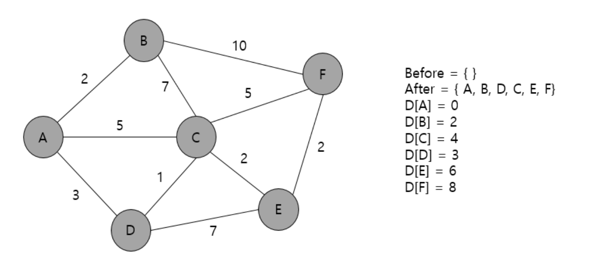

# 다익스트라 알고리즘

**관련 문제**

- [x]  [https://www.acmicpc.net/problem/18352](https://www.acmicpc.net/problem/18352)
- [x]  [https://www.acmicpc.net/problem/1446](https://www.acmicpc.net/problem/1446)
- [ ]  [https://www.acmicpc.net/problem/17396](https://www.acmicpc.net/problem/17396)
- [ ]  [https://www.acmicpc.net/problem/5972](https://www.acmicpc.net/problem/5972)
- [ ]  [https://www.acmicpc.net/problem/1753](https://www.acmicpc.net/problem/1753)
- [ ]  [https://www.acmicpc.net/problem/1504](https://www.acmicpc.net/problem/1504)
- [ ]  [https://www.acmicpc.net/problem/1238](https://www.acmicpc.net/problem/1238)

---

그래프에서 음의 가중치가 없는 여러 개의 노드가 있을 때, 특정한 노드에서 출발해 다른 노드로 가는 각각의 최단 경로를 구하는 알고리즘.

기본적으로 그리디 알고리즘이며 DP기법을 사용한다.

- 방문하지 않은 노드 중 가장 비용이 낮은 간선을 선택
- 해당 노드로부터 갈 수 있는 노드들의 비용을 갱신.
1. 출발 노드를 설정.
2. 최단 거리 테이블을 초기화.
3. 방문하지 않은 노드 중 가장 비용이 적은 대상 노드 선택.
4. 해당 노드를 거쳐 다른 노드로 가능 비용을 계산해 최단 거리 테이블을 갱신
5. 3, 4 반복

---

### 예시

**#1.**


- 방문 여부를 체크할 배열 준비
- 출발 노드로부터 각 노드까지의 최소 비용을 저장할 배열 준비
- 출발노드는 A이므로 A까지 가능 최소 비용을 0으로 설정

**#2.**



- A 노드에서 갈 수 있는 노드 B, C, D에 대해 최소 비용 갱신.
- A 방문 여부에 체크

**#3.**


- 방문하지 않은 B,C,D,E,F 중 가장 낮은 비용은 2로 B.
- B 노드에서 갈 수 있는 노드 C, F 에 대해 조사.
    - A→C는 5 지만 A→B→C는 9의 비용, 갱신 X.
    - D[F]값 갱신 가능, “현재 노드의 비용(출발노드인 A부터 현재 노드까지의 비용) + 현재 노드에서 F까지의 비용”인 12로 설정.
- B 방문 여부에 체크

**#4.**


- 방문하지 않은 C, D, E, F 중 D가 비용 3으로 가장 낮음.
- D 노드에서 갈 수 있는 노드 C, E에 대해 조사
    - A→C 비용 5 보다, A→D→C 비용 4가 더 낮으므로 갱신.
    - E는 가본적 없으므로 10으로 설정.
- D 노드 방문 여부에 체크

**#5.**


- 방문하지 않은 C, E, F 중 C가 비용 4로 가장 낮음.
- C노드에서 E, F로 갈 수 있음
    - A로부터 출발해 C → F 의 비용인 4 + 5가 기존 D[F] 12보다 낮으므로 갱신.
    - D[E]또한 4 + 2가 기존 10보다 낮으므로 갱신.
- C노드 방문처리

**#6.**


- 방문하지 않은 E,F노드 중 비용이 6으로 더 낮은 E노드 선택
- E노드에서 F노드로 갈 수 있음
    - A로부터 출발해 E까지의 거리 6에 E→F 비용 2를 더한 8이 기존 9보다 낮으므로 갱신
- E노드 방문 처리

**#7.**



- 방문하지 않은 F노드 선택
- 방문할 수 있는 노드 없음
- F노드 방문 처리

---

## 코드 예시

**우선 순위 큐 미적용**

```java
public class Boj_18352 {
    List<Integer>[] map;
    boolean[] visited;
    int[] dp;
    int n, m, k, x;

    int getMinCostNode() {
        int minCost = Integer.MAX_VALUE;
        int minNode = 0;
        for (int i = 1; i <= n; i++) {
            if (!visited[i] && dp[i] < minCost) {
                minCost = dp[i];
                minNode = i;
            }
        }
        return minNode;
    }

    public void solution() throws IOException {
        BufferedReader br = new BufferedReader(new InputStreamReader(System.in));

        String[] line = br.readLine().split(" ");
        n = Integer.parseInt(line[0]);
        m = Integer.parseInt(line[1]);
        k = Integer.parseInt(line[2]);
        x = Integer.parseInt(line[3]);

        dp = new int[n + 1];
        Arrays.fill(dp, Integer.MAX_VALUE);
        visited = new boolean[n + 1];
        map = new ArrayList[n + 1];
        for (int i = 0; i < n + 1; i++)
            map[i] = new ArrayList<>();

        for (int i = 0; i < m; i++) {
            line = br.readLine().split(" ");
            int node1 = Integer.parseInt(line[0]);
            int node2 = Integer.parseInt(line[1]);
            map[node1].add(node2);
        }

				// 우선순위 큐 미적용. -> 시간초과.
        dp[x] = 0;
        for (int i = 1; i <= n; i++) {
            int minNode = getMinCostNode();
            for (int next : map[minNode]) {
                int newCost = dp[i] + 1;
                if (dp[next] > newCost)
                    dp[next] = newCost;
            }
            visited[minNode] = true;
        }

        boolean exist = false;
        for (int i = 1; i <= n; i++) {
            if (dp[i] == k) {
                exist = true;
                System.out.println(i);
            }
        }
        if (!exist) System.out.println("-1");
    }
}

```

```java
dp[x] = 0;
for (int i = 1; i <= n; i++) {
		int minNode = getMinCostNode();
				for (int next : map[minNode]) {
						int newCost = dp[i] + 1;
						if (dp[next] > newCost)
								dp[next] = newCost;
				}
		visited[minNode] = true;
}
```

위 `int newCost = dp[i] + 1` 부분에서 dp[i] + 1로 한 이유는 해당 문제의 간선의 가중치가 모두 1이라고 하였기 때문이다.

만약 간선 가중치가 1이 아닌 모두 다른 값을 가졌다면 아래와 같이 Node 객체를 만들어 dp[i] + 1이 아닌 dp[i] + next.cost를 더해주면 된다.

```java
class Node {
		int num;
		int cost;
		
		Node(int num, int cost) {
				this.num = num;
				this.cost = cost;
		}
}
```

위와 같이 제출을 하면 시간초과에 걸리게 된다.

**우선순위 큐 적용**

```java
// 우선순위 큐를 적용하는 경우.
PriorityQueue<Integer> q = new PriorityQueue<>();
q.offer(x);
dp[x] = 0;
while (!q.isEmpty()) {
    int now = q.poll();

    for (int next : map[now]) {
        int newCost = dp[now] + 1;
        if (dp[next] > newCost) {
            dp[next] = newCost;
            q.offer(next);
        }
    }
}
```

노드의 비용이 다른 경우는 아래와 같이 작성한다.

```java
//노드의 크기, 출발지
public static void Dijkstra(int n, int start) {
    boolean[] visited = new boolean[n + 1];
    int[] dp = new int[n + 1];

    Arrays.fill(dist, Integer.MAX_VALUE);
    dp[start] = 0;

    PriorityQueue<Node> pq = new PriorityQueue<>();
    pq.offer(new Node(start, 0));

    while(!pq.isEmpty()) {
        int nowIdx = pq.poll().index;

        if(visited[nowIdx]) continue;
        visited[nowIdx] = true;

        //index의 연결된 정점 비교
        for(Node next : map[nowIdx]) {
            if(dp[next.num] > dp[nowIdx]+ next.cost) {
                dp[next.num] = dp[nowIdx] + next.cost;

                pq.offer(new Node(next.num, dp[next.num]));
            }
        }
    }

    //최소거리 출력
    for(int i : dp) {
        if(i == Integer.MAX_VALUE) 
		        System.out.print(0 + " ");
        else 
		        System.out.print(i + " ");
    }
}
```