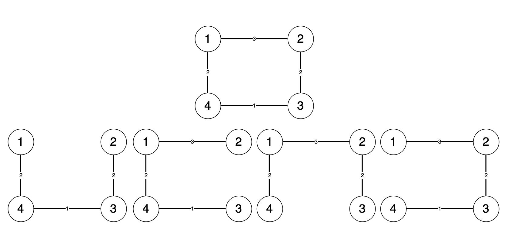
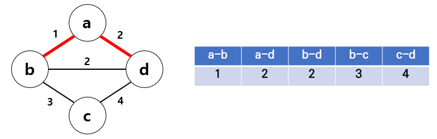
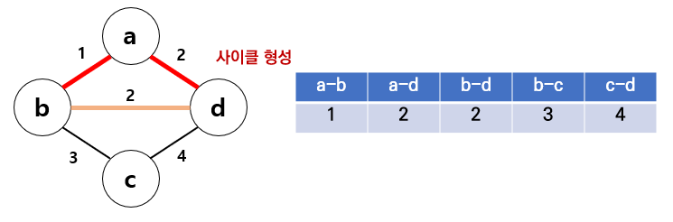
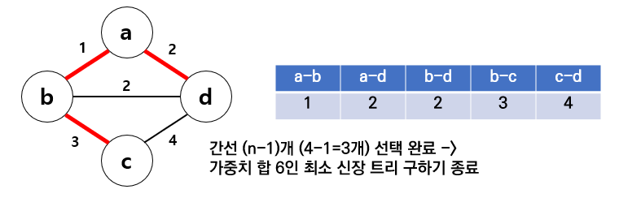
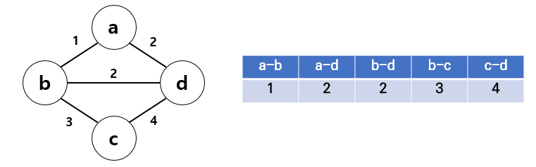

# 크루스칼 알고리즘

예제

- [x]  [https://www.acmicpc.net/problem/1922](https://www.acmicpc.net/problem/1922)
- [ ]  [https://www.acmicpc.net/problem/1647](https://www.acmicpc.net/problem/1647)
- [ ]  [https://www.acmicpc.net/problem/6497](https://www.acmicpc.net/problem/6497)

## 최소 신장 트리



위 그림에서 정점 1, 2, 3, 4가 모두 연결된 그래프가 있을 때, **모든 정점을 포함**하고 **정점이 서로 연결**이 되어있으며(간선의 개수는 “정점의 개수 - 1”), **싸이클이 존재하지 않는** 부분 그래프를 신장트리(Spanning)라고 한다.

그 중 가중치의 합이 가장 작은 신장 트리를 **최소 신장 트리**(MST)라고 한다.

---

## 크루스칼 알고리즘

최소 신장 트리를 구하기 위한 알고리즘이다. 즉 그래프 내의 모든 정점을 가장 적은 비용으로 연결하기 위해 사용된다.

### **동작 과정**

기본적으로 그리디 알고리즘이다.

**#1.**



- 그래프 간선을 가중치 오름차순으로 정렬한다.

**#2.**



- 가중치가 낮은 순서대로 선택한다.
    1. a - b 의 가중치가 1로 가장 작으므로 선택한다.
    2. a - d 의 가중치가 2로 그 다음으로 작으므로 선택한다.

**#3.**



- 그 다음으로 작은 b - d를 선택하게 되면 사이클이 형성된다.
- 사이클이 형성되면 그 간선은 선택하지 않는다.

**#4.**



- 그래프가 모두 연결이 되었다면 최소 신장 트리를 구하는 알고리즘이 종료된다.

### 간선 선택 시 사이클을 판단하는 방법.

Union Find 알고리즘을 활용할 수 있다.

유니온 파인드는 union을 이용해 서로소 부분 집합들로 나누어진 원소들 합칠 수 있고, find를 이용해 노드가 여러개 있을 때 두 노드가 같은 그래프에 속해있는지 알 수 있다.

```java
// union
static void union(int node1, int node2) {
    node1 = adv_find(node1);
    node2 = adv_find(node2);

    if (node1 == node2) return ;

    if (node1 < node2) {
        parents[node2] = node1;
    } else {
        parents[node1] = node2;
    }
}
```

```java
static int find(int node) {
    if (parents[node] == node) return node;
    return find(parents[node]);
}
```

```java
static int adv_find(int node) {
    if (parents[node] != node) parents[node] = find(parents[node]);
    return parents[node];
}
```

- parents 배열에 각 노드들의 부모 노드를 저장한다.
- 간선이 연결 될 시 union을 이용하여 번호가 작은 노드를 부모 노드로 설정한다.
- **find연산의 결과로 만약 부모가 같다면 간선을 연결 할 시 사이클이 형성된다.** → 이 경우 그 간선을 선택하지 않으면 된다.

---

## 예제

**백준 1922**

- 컴퓨터(정점)와 컴퓨터를 연결하는데 비용(간선의 가중치)이 든다.
- 네트워크를 구축하기 위해 모든 컴퓨터가 연결되어 있어야 하는데 구축하는데 가장 적게 드는 비용 출력.
- 즉, 최소 신장 트리의 가중치의 합을 구하는 문제.

```java
public class Boj_1922 {
    static int n, m;
    static int[] parents;

    static class Connection {
        int node1;
        int node2;
        int weight;

        Connection(int node1, int node2, int weight) {
            this.node1 = node1;
            this.node2 = node2;
            this.weight = weight;
        }
    }
    
    static int find(int n) {
		    // 생략
    }
    static int adv_find(int n) {
		    // 생략
    }
    static void union(int n1, int n2) {
		    // 생략
    }

    public void solution() throws IOException {
        BufferedReader br = new BufferedReader(new InputStreamReader(System.in));

        n = Integer.parseInt(br.readLine());
        m = Integer.parseInt(br.readLine());

        Connection[] connections = new Connection[m];
        parents = new int[n + 1];
        for (int i = 0; i <= n; i++)
            parents[i] = i;

        for (int i = 0; i < m; i++) {
            String[] line = br.readLine().split(" ");
            int n1 = Integer.parseInt(line[0]);
            int n2 = Integer.parseInt(line[1]);
            int w = Integer.parseInt(line[2]);
            connections[i] = new Connection(n1, n2, w);
        }

				// 가중치 오름차순으로 정렬.
        Arrays.sort(connections, (a, b) -> a.weight - b.weight);
        
        int cost = 0;
        int cnt = 0;
        for (Connection c : connections) {
            int p1 = adv_find(c.node1);
            int p2 = adv_find(c.node2);
            if (p1 == p2) continue; // 부모가 같을 시 union하면 사이클 발생.
            union(c.node1, c.node2);
            cost += c.weight;
            cnt++;
            if (cnt == n - 1) break; // 연결된 간선 수가 "정점 - 1"이면 모든 정점 연결된 경우.
        }

        System.out.println(cost);
    }
}
```

---

**📄참고 문서**

[https://chanhuiseok.github.io/posts/algo-33/](https://chanhuiseok.github.io/posts/algo-33/)