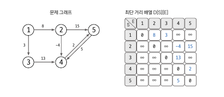
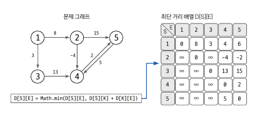
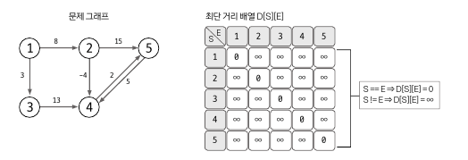

# 플로이드-워셜 알고리즘

다익스트라는 시작점에서 다른 노드들까지의 최단거리를 구하는 알고리즘

플로이드-워셜 알고리즘은 모든 노드에 대해 다른 모든 노드로의 최단거리를 구할 수 있음. 다익스트라와 달리 음의 가중치를 가지고 있어도 수행 가능하며, 시간 복잡도는 O(N^3)이다.

---

### 기본 원리

- A -> B로가는 비용을 A -> 중간 노드 -> B 의 비용과 비교해 비용이 더 적은 값으로 갱신한다.
- 2차원 배열에 최단거리 정보를 저장하며 dist[s][e]는 s노드에서 e노드까지의 최단거리이다.

---

### 동작 순서

**#1.**



- s==e일 경우 즉 예를 들어 1번 노드에서 1번 노드로 가능 경우, 최단거리는 0이다.
- 초기화 시 s == e인 경우 0으로, 그 외의 경우 INF으로 초기한다.

**#2.**



- 가중치가 있는 경우에 대하여 값을 설정한다.
- 위 그림의 경우 1 → 2 (8), 1 → 3 (3), 2 → 5 (15) .. 이므로 D[1][2] = 8, D[1][3] = 3 .. 으로 값 설정 할 수 있다.

**#3.**



- 3중 for문으로 배열을 갱신한다.

```java
for (int m = 1; m <= n; m++) {
		for (int s = 1; s <= n; s++) {
				for (int e = 1; e <= n; e++) {
						if (dist[s][e] == Integer.MAX_VALUE 
								|| dist[e][s] == Integer.MAX_VALUE) continue;
								
						if (dist[s][m] + dist[m][e] < dist[s][e])
								dist[s][e] = dist[s][m] + dist[m][e];
						// 아래와 같이 Math.min으로 작성 가능.
						// dist[s][e] = Math.min(dist[s][e] + dist[s][m] + dist[m][e]);
				}
		}
}
```

- mid node → start node → end node 로 for문 순서 중요함.
- start node → end node → mid node 순으로 할 시 mid node에 대한 반복문을 한바퀴 돌면 다시는 d[start node][end node]값을 갱신하지 않음.

---

### 예제

**백준 11404**

```java
import java.io.*;
import java.util.*;

public class Boj_11404 {
    public void solution() throws IOException {
        int INF = 100_000_001;
        BufferedReader br = new BufferedReader(new InputStreamReader(System.in));
        int n = Integer.parseInt(br.readLine());
        int m = Integer.parseInt(br.readLine());

        int[][] dist = new int[n + 1][n + 1];
        for (int i = 0; i <= n; i++) {
            for (int j = 0; j <= n; j++) {
                if (i == j) dist[i][j] = 0;
                else dist[i][j] = INF;
            }
        }

        for (int i = 0; i < m; i++) {
            String[] line = br.readLine().split(" ");
            int start = Integer.parseInt(line[0]);
            int end = Integer.parseInt(line[1]);
            int weight = Integer.parseInt(line[2]);
            dist[start][end] = Math.min(weight, dist[start][end]);
        }

				// 플루이드 와샬
        for (int mid = 1; mid <= n; mid++) {
            for (int s = 1; s <= n; s++) {
                for (int e = 1; e <= n; e++) {
                    if (dist[s][mid] == INF
                            || dist[mid][e] == INF) continue;

                    if (dist[s][mid] + dist[mid][e] < dist[s][e])
                        dist[s][e] = dist[s][mid] + dist[mid][e];
                }
            }
        }

				// 출력부분
        StringBuilder sb = new StringBuilder();
        for (int i = 1; i <= n; i++) {
            for (int j = 1; j <= n; j++) {
                int d = dist[i][j];
                if (d == INF) d = 0;
                sb.append(d).append(" ");
            }
            sb.append("\n");
        }
        System.out.print(sb);
    }
}

```

- INF값의 설정을 충분히 크게할 필요 있음.